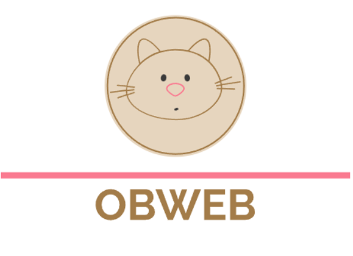

# Obweb : Obsidian + Web = Obsdian on Mobile + Flomo

<p align="center">
  
</p>

## Motivation

[Obsidian](https://obsidian.md/) and [Flomo](https://flomoapp.com/) are two of my favorite Applications.

I use Obsidian for knowledge management and Flomo for my thoughts or memos.

But Obsidian don't have a mobile version for Andriod and flomo don't work well with Obsidian. I decided to create a Web interface for Obsidian, so I can use it on my mobile devices and work in the way of flomo.

I don't want to store any data on other third-party servers, here we will deploy it on our own server.

## Dev

+ Backend: Rust + Warp for API
+ Frontend: Javascript, Bootstrap, JQuery. I'm a novice in Javascript :)


The `UI` is designed to be more suitable for a mobile device. On PC/Mac, the Obsidian native application is more convenient.

Most part of code is straightforward, there are some hard-coded part. For a MVP, I want to keep it stupid and simple.

Maybe you need to do some trivial tweaks. Any PR is welcome to make it better and useful for others.

## Usage

Obweb assume you have your Obsidian repo cloned on the server, and you have permission to push to Git repo. When you are posting things from API, Obweb will push things to remote.


If you didn't installed Rust, run with command:

```bash
curl --proto '=https' --tlsv1.2 -sSf https://sh.rustup.rs | sh
```

1. Initialize login accounts, create `db/accounts.json` with your customed accounts:
```json
[{
    "username": "user name",
    "password": "password"
}]
```

2. Initialize Obsidian repo:

```bash
git clone http://your-ob-repo ob

cd ob
git config user.email "you@example.com"
git config user.name "Your Name"
```

3. Run server:
```bash
./bin/debug

```
Now you can access it on your browser [http:://localhost:8005/obweb](http:://localhost:8005/obweb).

Or you may start with Docker:

```bash
docker-compose up

```

----

**I use this App everyday, hope it will be useful for you.**